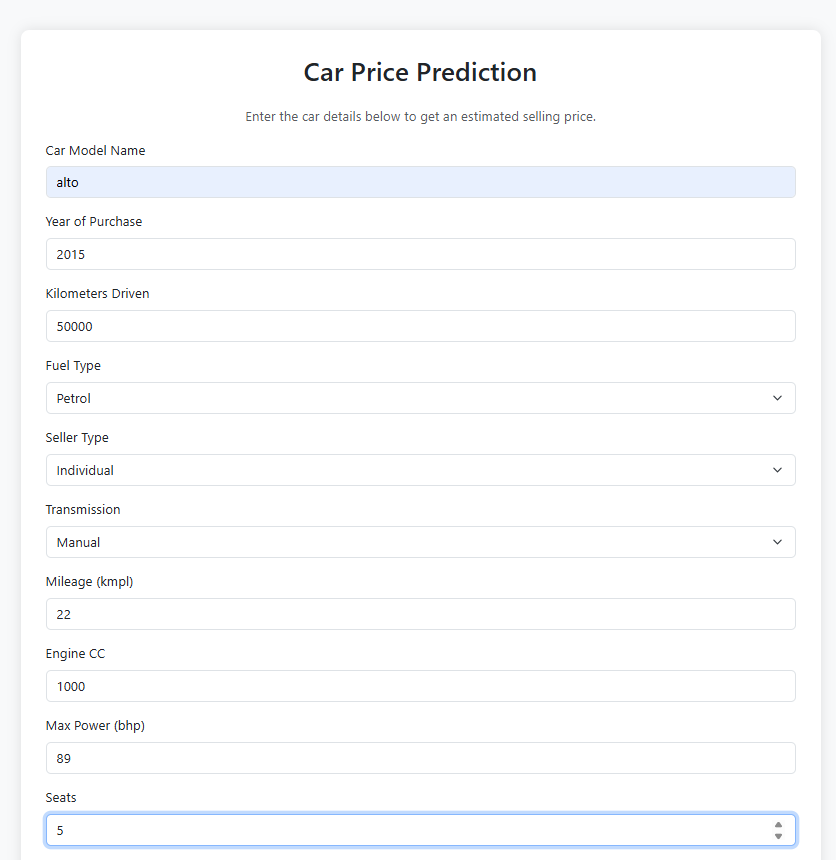
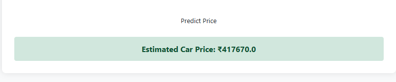

#  Car Price Prediction System

###  Overview
This project is a Machine Learning web application that predicts the selling price of used cars based on various features like car model, year of purchase, fuel type, transmission, and kilometers driven.This project dataset is taken from cardekho website.

The system uses a **Random Forest Regressor** model trained on the Cardekho dataset, achieving an **R² score of 0.94**, ensuring highly accurate price estimations.

###  Demo
 
 

###  Tech Stack
* **Frontend:** HTML, CSS, Bootstrap 5
* **Backend:** Flask (Python)
* **Machine Learning:** Scikit-Learn, Pandas, NumPy
* **Model:** Random Forest Regressor (Ensemble Learning)


###  Model Performance
After experimenting with Linear Regression, KNN, and Decision Trees, **Random Forest** yielded the best results:
* **Training Accuracy:** ~97%
* **Test Accuracy (R² Score):** 94.13%
* **Validation:** Cross-validated to ensure no overfitting.

###  Project Structure
```text
CAR_PRICE_PREDICTION/
│
├── Dataset/                 # Raw dataset (Cardekho)
├── Models/                  # Serialized Model (Pickle file)
├── Notebooks/               # Jupyter Notebooks for EDA & Training
├── templates/               # HTML files for the web interface
├── app.py                   # Flask backend application
├── requirements.txt         # List of dependencies
└── .gitignore               # Files to ignore (pycache, etc.)

###  How to Run Locally

1.  **Clone the repository**
    ```bash
    git clone [https://github.com/itsabhisingh07/Car-Price-Prediction.git](https://github.com/itsabhisingh07/Car-Price-Prediction.git)
    cd Car-Price-Prediction
    ```

2.  **Install dependencies**
    ```bash
    pip install -r requirements.txt
    ```

3.  **Run the application**
    ```bash
    python app.py
    ```

4.  **Open browser**
    Go to `http://127.0.0.1:5000/` to use the predictor.
